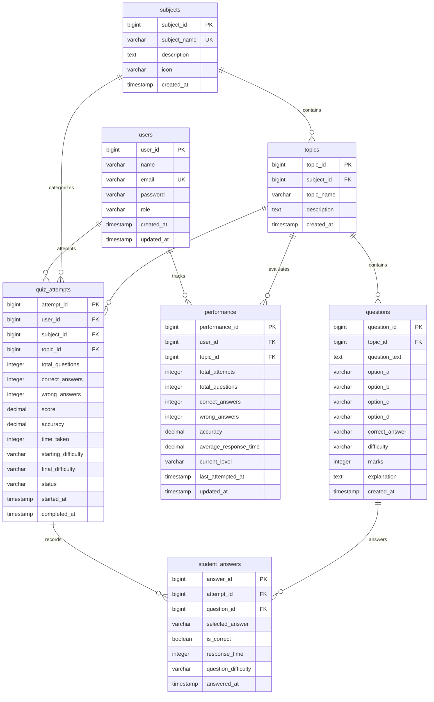

# Entity-Relationship (ER) Diagram

**Project**: Exam Preparation App With Adaptive Quizzes  
**Database**: PostgreSQL 18  

---

## 1. Visual Mermaid ER Diagram

---

## 2. Cardinality & Relationships

| Source Entity | Target Entity | Cardinality | Relationship Description |
|---|---|---|---|
| `users` | `quiz_attempts` | $1 : N$ | One student can take multiple quiz attempts. |
| `users` | `performance` | $1 : N$ | One student has a performance record for each attempted topic. |
| `subjects` | `topics` | $1 : N$ | One subject groups multiple academic topics. |
| `topics` | `questions` | $1 : N$ | One topic contains multiple questions partitioned by difficulty. |
| `quiz_attempts` | `student_answers` | $1 : N$ | One attempt records a sequential set of student question answers. |
| `questions` | `student_answers` | $1 : N$ | A question can be answered across multiple student quiz attempts. |
| `topics` | `performance` | $1 : N$ | A topic tracks performance across various students. |
