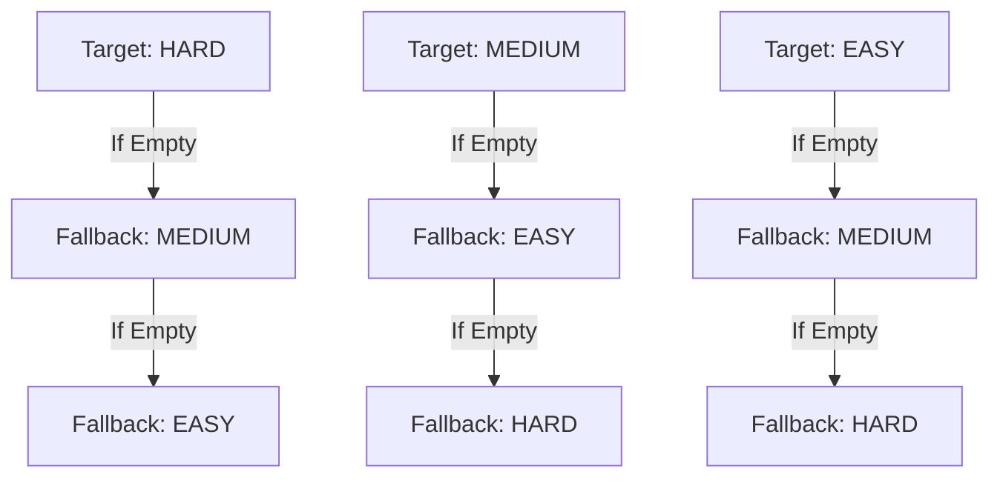

# Adaptive Quiz Engine Specification & Mathematical Model

**Project**: Exam Preparation App With Adaptive Quizzes  
**Engine Class**: `com.examapp.service.AdaptiveQuizService`  

---

## 1. Pedagogical Objective

Standard testing models present questions in static difficulty order, often causing disengagement (if too easy) or frustration (if too difficult). The **Adaptive Quiz Engine** dynamically calibrates problem difficulty in real time according to the student's emerging competency profile.

---

## 2. Mathematical Calibration Model

Let $N$ denote the number of questions answered in the current test session ($N \ge 0$), and $C$ denote the count of correctly answered questions ($0 \le C \le N$).

### 2.1 Initial State ($N = 0$)
Every quiz attempt initializes at the **MEDIUM** baseline tier:
$$D_0 = \text{MEDIUM}$$

### 2.2 Rolling Accuracy Metric
At each step $k$ ($1 \le k \le T$, where $T$ is total attempt size), the real-time accuracy is computed:
$$\text{Accuracy}_k = \left( \frac{C_k}{k} \right) \times 100$$

### 2.3 Tier Transition Function
The target difficulty $D_{k+1}$ for the subsequent question is mapped as follows:
$$
D_{k+1} = \begin{cases} 
\text{EASY}, & \text{if } \text{Accuracy}_k < 50.0\% \\
\text{MEDIUM}, & \text{if } 50.0\% \le \text{Accuracy}_k \le 75.0\% \\
\text{HARD}, & \text{if } \text{Accuracy}_k > 75.0\% 
\end{cases}
$$

---

## 3. Question Exclusion & Uniqueness Guarantee

To ensure academic rigor, a student is **never** presented with a duplicate question within the same attempt.

Let $\mathcal{A}_k = \{q_1, q_2, \dots, q_k\}$ be the set of question IDs already answered during the session. The candidate pool $\mathcal{Q}_{\text{candidate}}$ for topic $\tau$ and target difficulty $D_{k+1}$ is:
$$\mathcal{Q}_{\text{candidate}} = \left\{ q \in \text{Questions} \mid \text{topic}(q) = \tau \land \text{difficulty}(q) = D_{k+1} \land \text{id}(q) \notin \mathcal{A}_k \right\}$$

---

## 4. Deterministic Fallback Mechanism

In curriculum modules where questions within a specific tier are temporarily exhausted, the engine applies a deterministic adjacent-tier fallback:

---

## 5. Post-Quiz Learning Level Classification

Upon test completion, cumulative topic mastery is evaluated:
- $\text{Accuracy} \ge 85\% \implies \textbf{EXPERT}$
- $70\% \le \text{Accuracy} < 85\% \implies \textbf{ADVANCED}$
- $50\% \le \text{Accuracy} < 70\% \implies \textbf{INTERMEDIATE}$
- $\text{Accuracy} < 50\% \implies \textbf{BEGINNER}$
